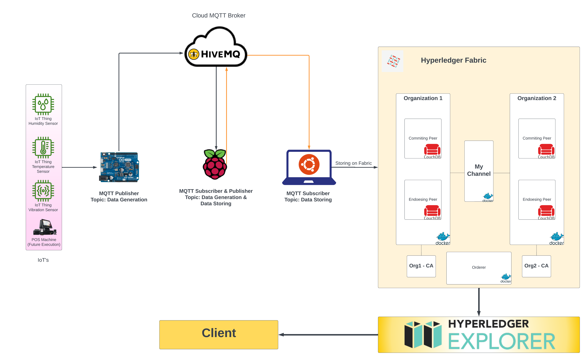

# Securing IoT via Hyperledger Fabric
## _This Project aims to design and develop a secure architectural environment for IoT(s) that provides automation with security layer of Blockchain technology, that introduces high Security and Privacy_

The Overall project is based upon the IoT automation System working under the Private Blockchain Network and can then be virtually accessed. 
We use the open-source IoT platform(s) “Hyperledger Explorer” or “ThingsBoard” for real-time data visualization. And use the Hyperledger Fabric blockchain network for providing a private blockchain network.

- Hyperledger Fabric (Private Blockchain)
- MQTT Protocol (IoT network connectivity)
- Hyperledger Explorer

## Activity Diagram

### Prerequisites

- MQTT Broker running on Raspberry Pi
- Hyperledger Fabric on main Server running
- [Docker](https://docs.docker.com/install/)

## Inspiration & Help
This projec is inspired from 
- [IBM Hyperledger-Fabric-for-Trusted-IoT](https://github.com/IBM/Hyperledger-Fabric-for-Trusted-IoT)
- [Pavan Adhav](https://github.com/adhavpavan/BasicNetwork-2.0)
- [Raspberry Pi Imager](https://www.raspberrypi.com/software/)
- [Advance IP finder](https://www.advanced-ip-scanner.com/)
- [Putty software](https://www.putty.org/)
- [HiveMQ](https://www.hivemq.com/)
